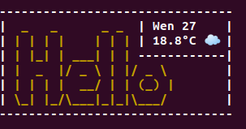

# BeautifulStart
Shows a beautiful banner at the start of your terminal



---
## Requirements 
* python3 installed
## Installation
Change [config.py](config.py) with your preferences
```
$ pip install -r requirements.txt
$ echo "python3 $(pwd)/BeautifulStart.py" >> ~/.bashrc
```
